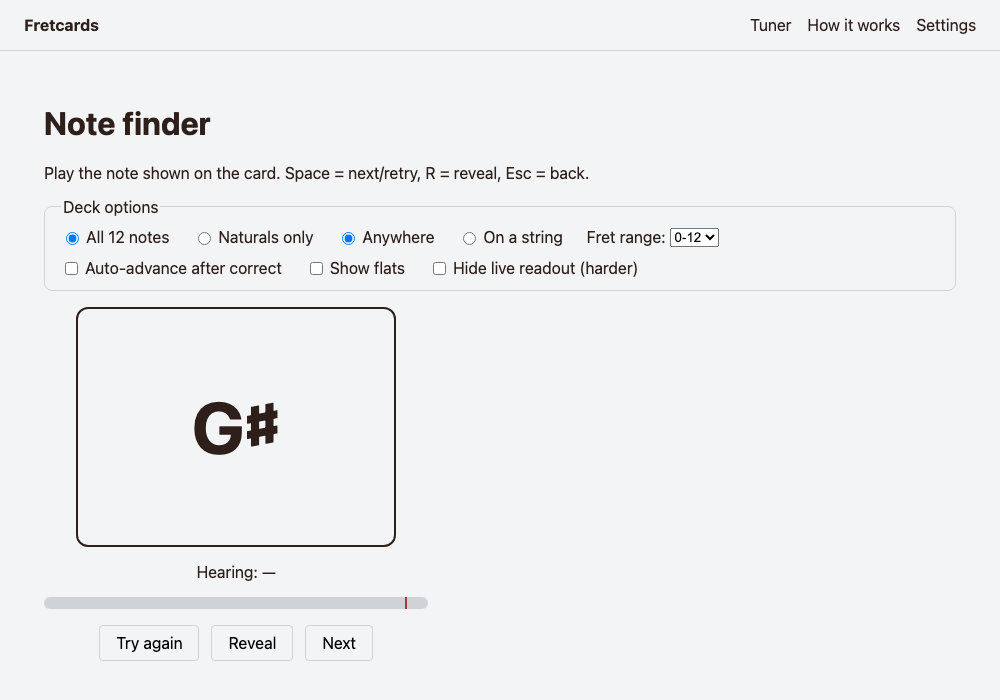
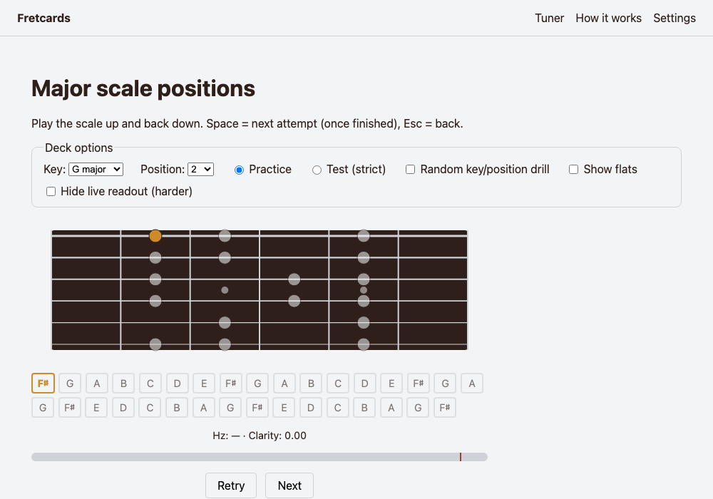
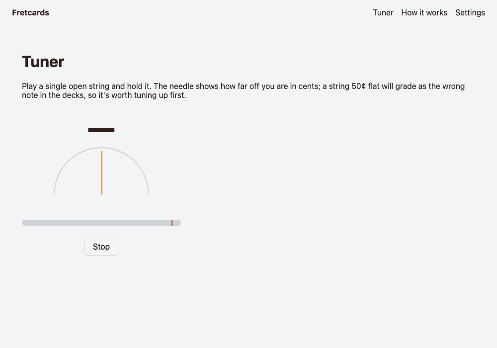
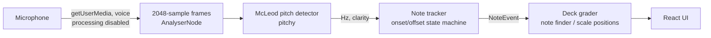

# Fretcards

Flashcards for musicians that listen through the microphone and grade what you play. v1 targets
acoustic guitar with two decks — **note finder** and **major scale positions**. Runs 100% in the
browser: no backend, no account, and audio never leaves the device.

Deploying to `fretcards.svej.org` via Cloudflare Pages — see Status below for what's left.

See [PLAN.md](./PLAN.md) for the full design doc and build plan, and [CLAUDE.md](./CLAUDE.md) for
conventions when working on this repo with Claude Code.

## Screenshots

| Note finder | Major scale positions | Tuner |
|---|---|---|
|  |  |  |

## How it works



The in-app "How it works" page (`/how-it-works`) walks through each stage in plain English, with
a live demo against your own mic.

**Code layout** mirrors that separation: `src/core` is pure, framework-free TypeScript (theory,
DSP, grading — runs and is tested in Node), `src/adapters` is the thin browser boundary
(`getUserMedia`, file decoding, `localStorage`), and `src/ui` is React. An ESLint rule enforces
that `src/core` never imports React, DOM, or Web Audio types.

```
src/
  core/        theory, fretboard/positions, audio (detector, tracker, synth), exercises (grading)
  adapters/    micSource, fileSource, storage
  ui/          routes, components, hooks, settings
```

## Testing

Claude Code can't play a guitar, so every audio feature is verified against synthesized fixtures
(a seeded Karplus-Strong plucked-string synth) instead — see PLAN.md section 4, constraint 10.

| Suite | What it covers |
|---|---|
| 1564 unit tests (Vitest) | theory, fretboard/positions (12 keys × 13 positions golden + property tests), the full pitch-detection pipeline against synthesized audio, both decks' grading logic and reducers |
| Full-pipeline synthetic accuracy | every string × fret 0–15, at 44.1kHz **and** 48kHz (192 cases): **100%** correct onset + MIDI. A weak-fundamental octave-error stress test and 20dB-SNR noise: **100%** correct. Sequence cases (repeated note, re-pick, silence, unpitched burst): all correct. |
| E2E (Playwright) | drives the *real* `getUserMedia` → `AnalyserNode` path via Chromium's fake-audio-capture, fed synthesized WAV fixtures — confirms noise-floor calibration, a clean tone reading correctly, and a planted wrong note being reported and ending a strict-mode attempt |

Real-guitar accuracy (the fixture eval described in PLAN.md section 8) is still pending — it needs
recordings from Svej's own guitar and mic, tracked in PLAN.md's decision log and Phase 7.

## Tech stack

Vite + React + TypeScript (strict), [pitchy](https://github.com/ianprime0509/pitchy) (McLeod Pitch
Method), Vitest, Playwright, plain CSS with custom properties. No UI framework, no state
management library — one reducer per deck, React Context for global settings.

## Commands

```bash
npm run dev            # start the dev server
npm run build           # typecheck + production build
npm run preview         # preview the production build
npm test                # unit tests (Vitest)
npm run test:e2e        # e2e tests (Playwright, Chromium)
npm run lint             # ESLint
npm run typecheck       # tsc, no emit
npm run eval:fixtures    # real-audio fixture accuracy report (Phase 7)
```

## Status

Phases 0–5 are complete (scaffold, core theory/fretboard, audio engine, both decks, product
polish). Deploy target is Cloudflare Pages, since DNS for svej.org already lives there — no risk
to the existing GCP-VM-served `svej.org`/`flights.svej.org`, no new DNS provider, zero server
maintenance (see PLAN.md section 10 and the decision log). The repo is ready
(`public/_redirects` for SPA routing, `public/_headers` for the mic `Permissions-Policy`); what's
left needs Svej's own Cloudflare account access:

- Connect this repo in the Cloudflare Pages dashboard (build command `npm run build`, output
  directory `dist`) and add the `fretcards.svej.org` custom domain
- Cross-browser verification (desktop Safari, iOS Safari, Android Chrome) — needs real devices
- A demo GIF — better recorded from an actual playing session than faked from synthetic audio
- Real-guitar accuracy numbers (Phase 7's fixture eval)

See PLAN.md section 9 for the full phase list and section 12 for the decision log.
